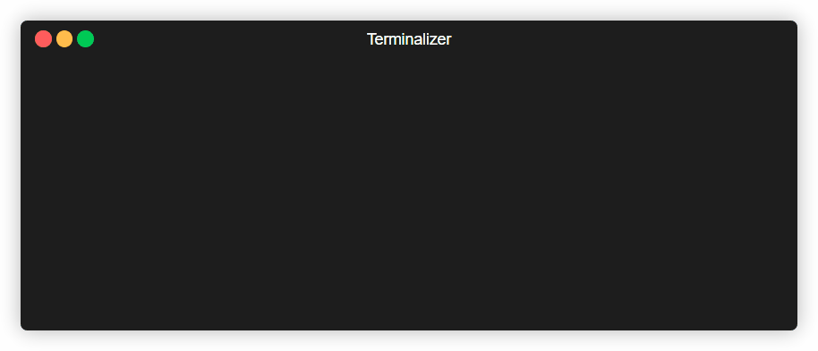

# 🔐 Gerador de Senhas Seguras

> Cansado de senhas como "123456" ou "senhaforte"? Este projeto cria senhas robustas e criptograficamente seguras diretamente do seu terminal, garantindo que suas contas estejam sempre protegidas.

 

---

## ✨ Características Principais

* **Geração Criptograficamente Segura:** Utiliza o módulo `secrets` do Python, ideal para gerar aleatoriedade segura para senhas, chaves e tokens.
* **Complexidade Garantida:** Cada senha gerada contém, no mínimo, uma letra maiúscula, uma minúscula, um número e um caractere especial. Chega de senhas que não atendem aos requisitos!
* **Aleatoriedade Real:** Após garantir os caracteres essenciais, a senha é embaralhada (`shuffle`) para que não haja um padrão previsível (como ter sempre um símbolo no final).
* **Comprimento Personalizável:** Escolha o tamanho da sua senha, de 8 a 128 caracteres, para se adequar a qualquer requisito de sistema.
* **Interface Simples:** Um script de linha de comando leve, rápido e fácil de usar. Sem complicações.

## 🚀 Como Usar

Para executar este projeto, você só precisa ter o Python 3 instalado.

1.  **Clone o repositório:**
    ```bash
    git clone https://github.com/MariaLamoglia/PasswordGenerator.git
    ```

2.  **Navegue até o diretório do projeto:**
    ```bash
    cd PasswordGenerator
    ```

3.  **Execute o script:**
    ```bash
    python password_generator.py
    ```

O script solicitará o número de dígitos desejado para a senha.

### Exemplo de Uso

```bash
$ python password_generator.py
Quantos dígitos na senha? (padrão: 12) 16

Senha gerada: 
T>Lp7#v8*k!zG@+R
```

Se você apenas pressionar `Enter`, uma senha de 12 caracteres será gerada por padrão.

---

## 🔧 Como Funciona

A segurança deste gerador não é por acaso. O processo segue uma lógica cuidadosa para garantir senhas fortes:

1.  **Validação Inicial:** O script verifica se o tamanho solicitado é válido (entre 8 e 128 caracteres).
2.  **Construção da Base Segura:** A senha começa com uma lista contendo 4 caracteres essenciais, um de cada tipo (minúscula, maiúscula, número e símbolo), selecionados de forma segura pelo módulo `secrets`.
3.  **Preenchimento Aleatório:** O restante do comprimento da senha é preenchido com caracteres totalmente aleatórios, escolhidos de um conjunto que inclui todas as letras, números e símbolos.
4.  **Embaralhamento Final:** Para evitar que os caracteres obrigatórios fiquem sempre no início, a lista completa de caracteres é embaralhada, garantindo que a posição de cada um seja imprevisível.
5.  **Resultado:** A lista de caracteres é unida para formar a string final da senha, que é então exibida para o usuário.

## 📄 Licença

Este projeto está sob a licença MIT. Veja o arquivo [LICENSE](LICENSE) para mais detalhes.

---

Criado com ❤️ por [Maria Lamoglia](https://github.com/MariaLamoglia).